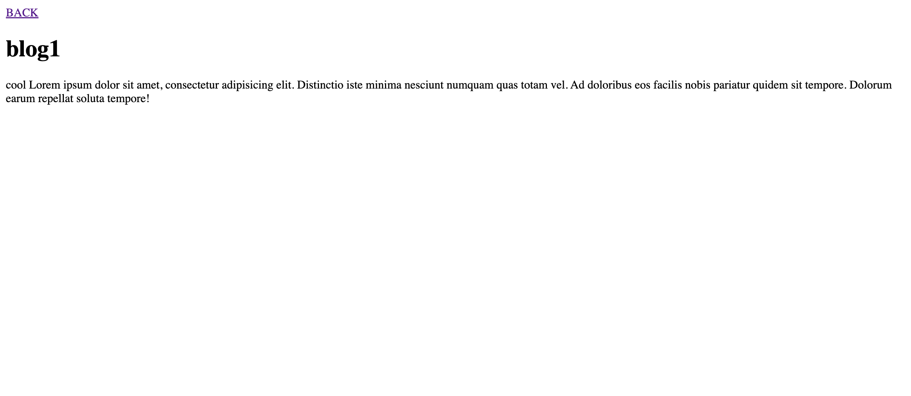

# Flask Server

## Description
In line with the next step in my learning, I delved into flask. While it was unsophisticated and sloppy, 
I made a flask server that would take templates that I created and fill them in with CSV. Having CSV allows 
for easier and more user friendly changes to a webpage that can be done by anyone if given a little bit of direction.
I also learned how to add seperate pages to my work and with that created seperate blog post pages that can be filled out easily. 

## Screenshot of completed project

